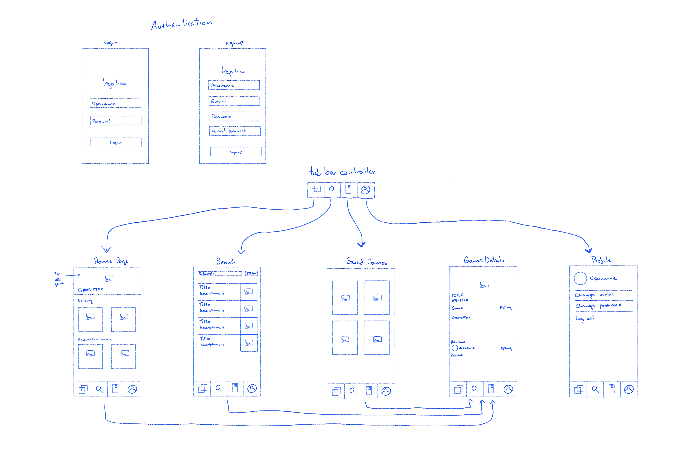

#WIP...

# GameScout

## Table of Contents

1. [Overview](#Overview)
2. [Product Spec](#Product-Spec)
3. [Wireframes](#Wireframes)
4. [Schema](#Schema)

## Overview
  
### Description

The "Gametime App" is a user-friendly and time-efficient solution for avid gamers seeking the latest video game releases across various platforms, including PC, PlayStation 5, Xbox, Nintendo Switch, and more. This app simplifies the process of discovering new games and staying updated on upcoming releases, catering to both beginners and experienced gamers.

### App Evaluation

Category:

  Our app falls into the category of "Entertainment" or "Gaming" apps. It serves as a valuable tool for gamers to discover and explore new games, making it an engaging entertainment app.

Mobile: 

  The app is designed primarily for mobile platforms, such as iOS and Android. It provides a mobile-friendly experience, allowing users to access it on the go, which aligns well with the mobile app category.

Story: 

  The story behind our app involves simplifying the process of discovering and staying updated on video game releases. It caters to the needs of gamers by offering a convenient and user-friendly platform for exploring new titles.

Market: 

  The market for gaming-related apps is substantial, given the immense popularity of video games. Our app targets gamers looking for a reliable source to discover and track new releases, addressing a clear market need.

Habit: 

  The app encourages user engagement by providing features like personalized recommendations, favorites lists, and user reviews. These features promote habitual use as gamers return to the app to find and discuss new games.

Scope: 

  As an MVP, our app focuses on essential features for game discovery and basic user interaction. It has a clear scope, offering a simplified experience. The scalability potential lies in expanding the game catalog and enhancing recommendation algorithms as the app evolves.

## Product Spec

### 1. User Stories (Required and Optional)

**Required Must-have Stories**

1. User can browse a catalog of video games.
2. User can search for games by platform.
3. User can search for games by genre.
4. User can view detailed information about a selected game.
5. User can see upcoming game releases with release dates.
6. User can read user-generated game reviews and ratings.
7. User can add games to their favorites list.
8. User can receive personalized game recommendations.
9. User can provide feedback and suggestions.
10. User can create an account.
11. User can log in.
12. User can manage their profile and settings.

**Optional Nice-to-have Stories**

1. **User can view a more detailed game screen:** Provide users with a dedicated screen to view a selected game in more detail, including user comments and discussions.
2. **User can see trending games**: Implement a section that displays trending or popular games based on user interactions and ratings.
3. **User can see notifications for game interactions**: Notify users when their favorite games receive new reviews, ratings, or when users comment on them.
4. **User can see their profile page with their favorited games**: Allow users to access a profile page displaying their favorited games and user-generated content.
5. **User can view other users' profiles and see their favorited games**: Enable users to explore other users' profiles and see the games they have favorited.

### 2. Screen Archetypes

- Login/Registration
- User can create a new account.
- User can log in.
- Game Catalog
- User can browse a catalog of video games.
- User can search for games by platform.
- User can search for games by genre.
- User can view detailed information about a selected game.
- User can see upcoming game releases with release dates.
- Game Details
- User can read user-generated game reviews and ratings.
- User can add games to their favorites list.
- User can receive personalized game recommendations.
- User can provide feedback and suggestions.
- User Profile
- User can manage their profile and settings.
  
### 3. Navigation

**Tab Navigation** (Tab to Screen)
* Game Catalog
* Game Details
* User Pofile

**Flow Navigation** (Screen to Screen)

Login/Registration Screen
  * => Game Catalog (after successful login/registration)
Game Catalog Screen
  * => Game Details (when selecting a game for more information)
Game Details Screen
  * => User Profile (for user interactions like adding to favorites)
User Profile Screen
  * No direct navigation to other screens from this screen.

This navigation flow outlines how users can move between different sections of the app, 
from browsing the game catalog to accessing game details and managing their user profile. 
It's designed to provide an intuitive and efficient user experience.

## Wireframes

### [BONUS] Digital Wireframes & Mockups

[Click to open Figma mockups](https://www.figma.com/file/gdRQXj06kOZyOxlF9SahrL/Untitled?type=design&node-id=0%3A1&mode=design&t=eg5B5jfitnzW44TA-1)

## Schema 

[This section will be completed in Unit 9]

### Models

[Add table of models]

### Networking

### Demo Day prep video

https://youtu.be/LQQnQCGKoDs

- [Add list of network requests by screen ]
- [Create basic snippets for each Parse network request]
- [OPTIONAL: List endpoints if using existing API such as Yelp]
